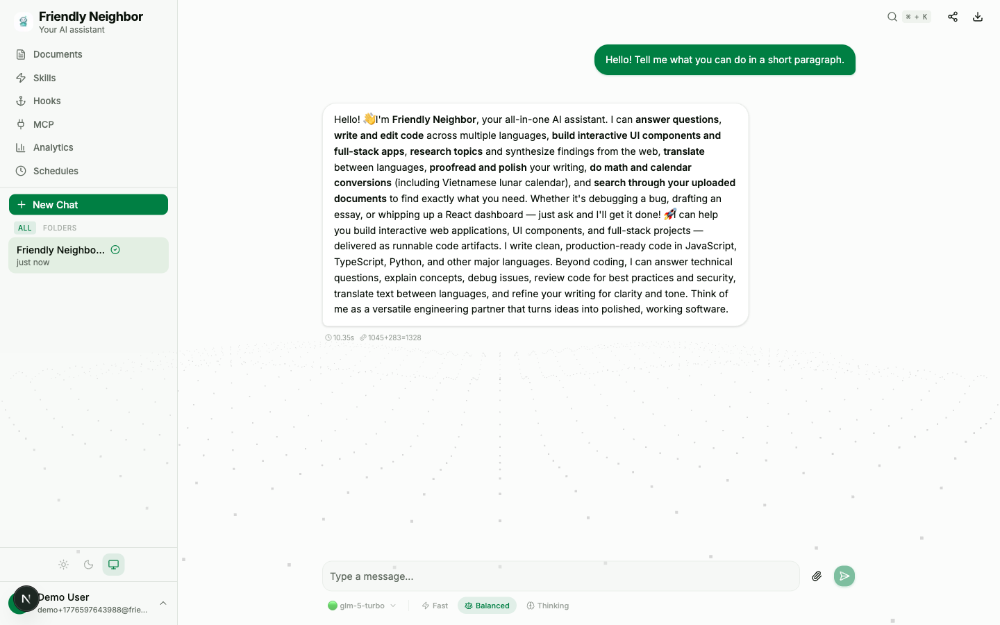
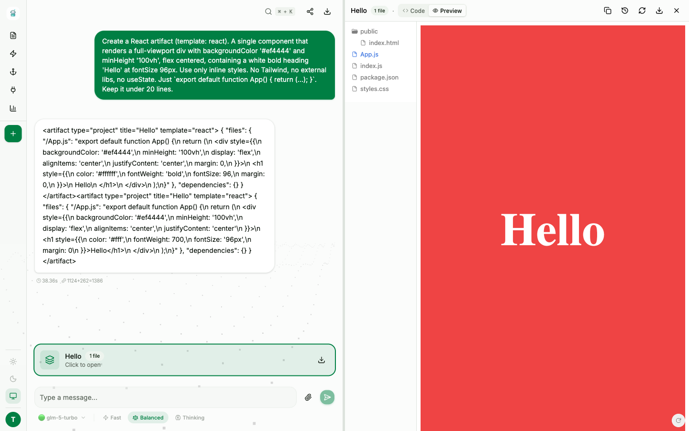
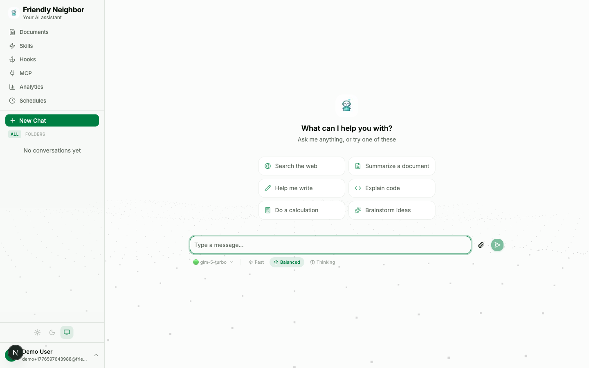
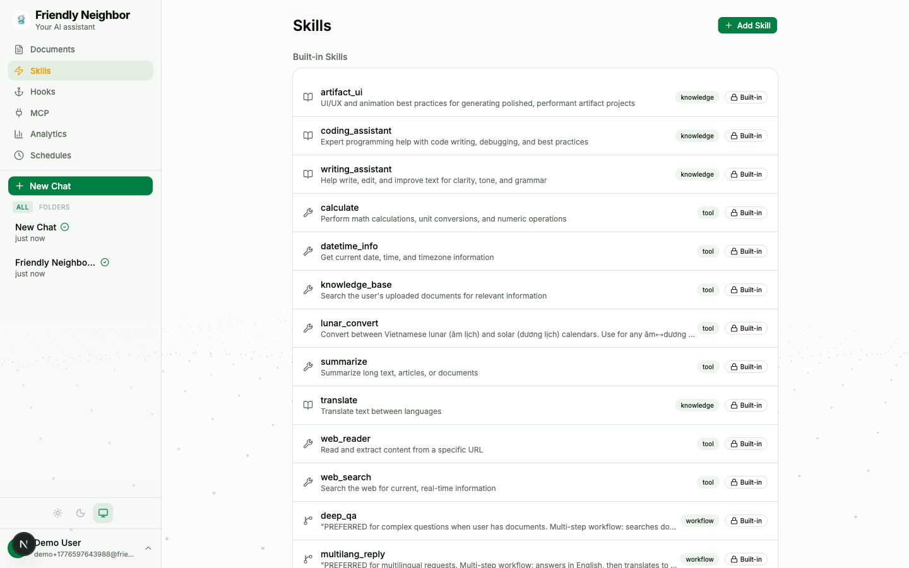
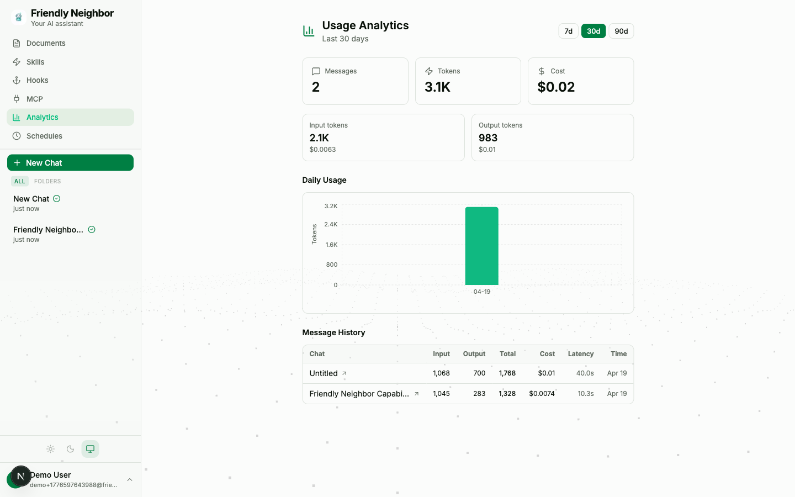
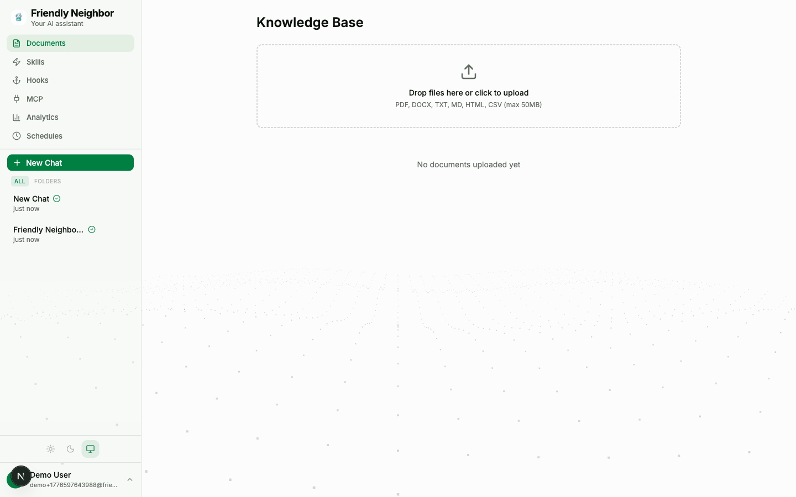
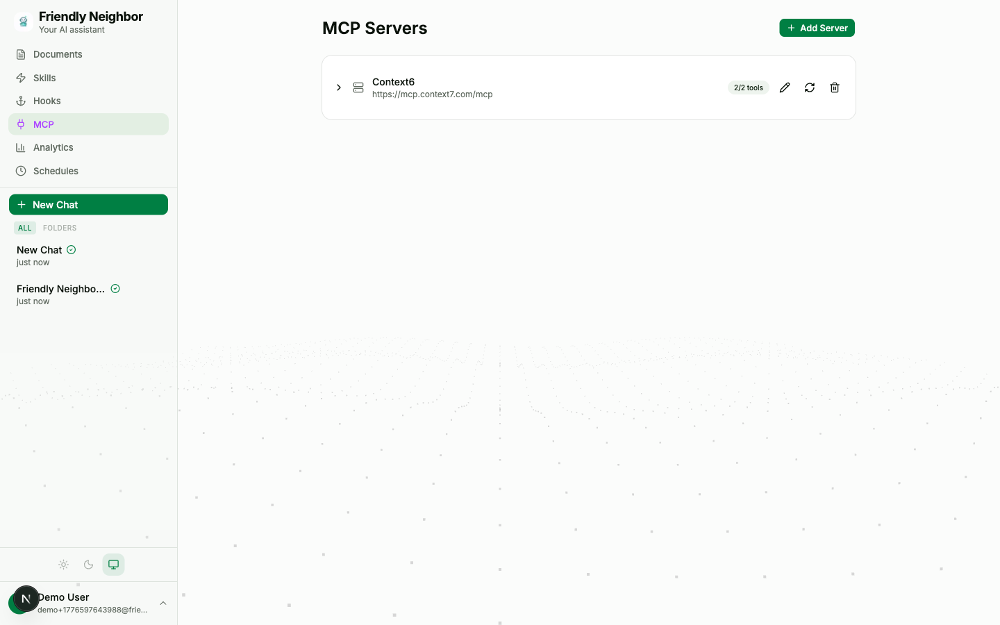
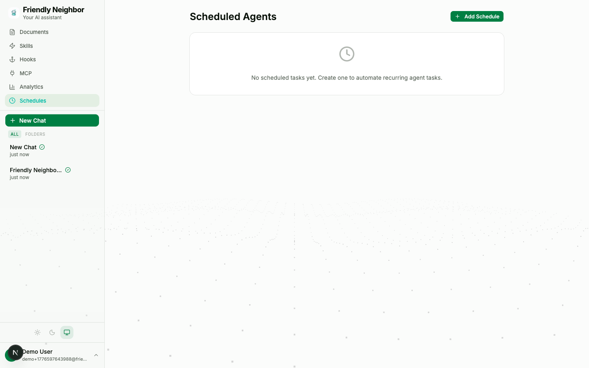
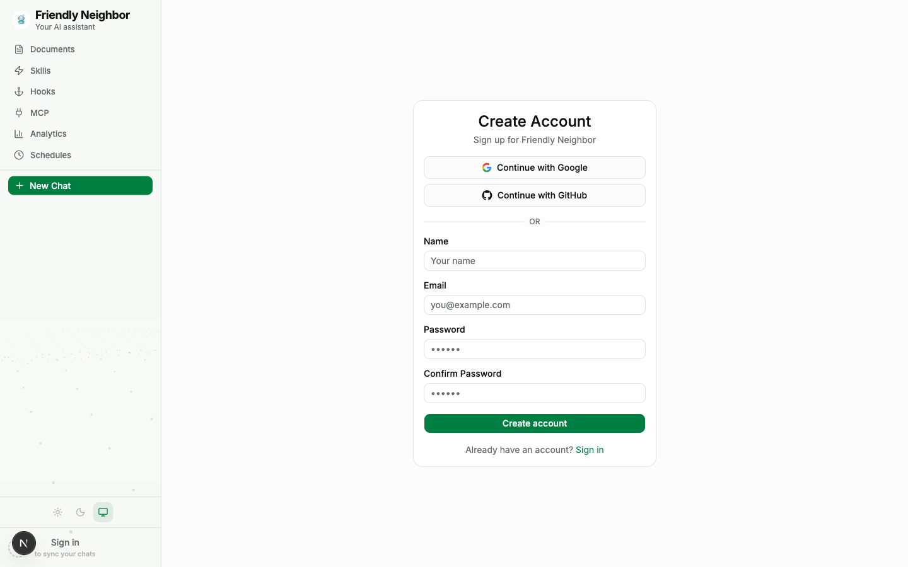
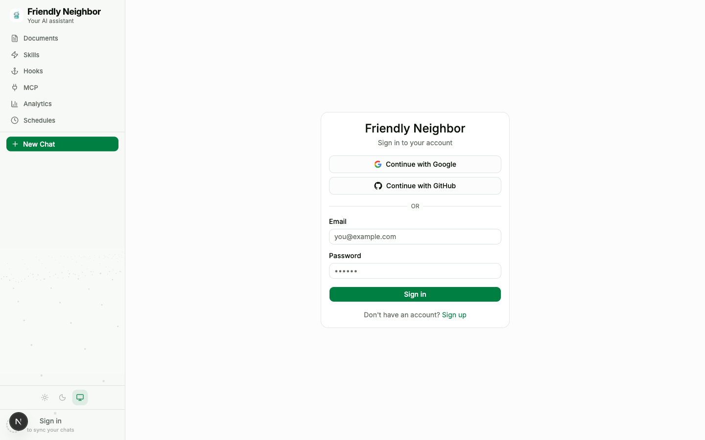

# Friendly Neighbor

An AI-powered chatbot agent that connects to any LLM provider, searches the web and your documents via RAG, and extends its capabilities through a markdown-based skill system. Features multi-model switching, conversation folders, admin dashboard, and a polished mobile experience.

## Screenshots

### Chat with streaming responses


### Live artifacts — LLM-generated React/HTML rendered in a side panel


### Home / empty state


<details>
<summary><b>More screenshots</b> — click to expand</summary>

<br>

**Skills library** — built-in and user-created skills, toggle on/off per-skill.


**Usage analytics** — per-message cost, token breakdown, daily chart.


**Knowledge base** — upload docs for RAG retrieval.


**MCP integration** — connect external tool servers.


**Scheduled agents** — cron-triggered chat runs.


**Register** / **Login** — JWT auth with OAuth (Google, GitHub) support.

<p>
  
  
</p>

</details>

> Screenshots are captured end-to-end by a Playwright script — see
> [`frontend/tests/readme-screenshots.spec.ts`](frontend/tests/readme-screenshots.spec.ts).
> Re-generate with `npx playwright test tests/readme-screenshots.spec.ts` from the `frontend/` directory.

## Features

### Core Chat
- **Multi-conversation support** — Create and manage separate chats organized by topic
- **Conversation folders** — Nested folder system with drag-and-drop, color/icon customization
- **Persistent chat history** — All messages and conversations stored in PostgreSQL
- **Streaming responses** — Real-time token streaming via Server-Sent Events (SSE)
- **Auto-generated titles** — Chat titles created automatically after first response
- **Full-text search** — Search across all conversations (Postgres tsvector)
- **Chat sharing** — Read-only shareable links with expiration
- **Conversation export** — Export chats as Markdown or PDF

### Multi-Model Switching
- **Project models** — Admin configures multiple models via `PROJECT_MODELS` env var with per-model base URLs
- **User custom models** — Users add their own models with encrypted API keys (Fernet)
- **Per-chat model selection** — Model picker dropdown in chat input
- **3-level fallback** — Per-chat model > user default > project default
- **Skill model override** — Skills can specify a preferred model in frontmatter

### AI Provider Support
- **Anthropic Claude** — Claude Sonnet and other models
- **OpenAI** — GPT-4o and other models
- **Any OpenAI-compatible API** — Z.ai (GLM-5), OpenRouter, Ollama, LiteLLM, etc.
- **Per-model base URLs** — Mix providers in a single instance (e.g., OpenAI + Z.ai)
- Configurable via `.env` — switch providers without code changes

### RAG Knowledge Base
- **Document upload** — PDF, DOCX, TXT, Markdown, HTML, CSV
- **Semantic chunking** — Header-aware splitting with configurable chunk size and overlap
- **Vector embeddings** — OpenAI `text-embedding-3-small`, stored in pgvector
- **Hybrid search** — Combines vector similarity with PostgreSQL full-text search via Reciprocal Rank Fusion (RRF)
- **Cohere reranking** — Optional two-stage retrieval using Cohere Rerank API for higher precision
- **Inline citations** — Numbered `[1]`, `[2]` markers in responses with clickable source excerpts
- **Background processing** — Upload returns immediately, processing runs async

### RAG Pipeline Details

The retrieval pipeline processes queries through multiple stages, each independently toggleable:

```
Query → Hybrid Search (vector + FTS → RRF fusion) → Reranking (Cohere) → Citation Formatting → LLM
```

**Hybrid Search** combines two retrieval methods for better recall:
- **Vector search** uses cosine similarity on pgvector embeddings to find semantically similar chunks
- **Full-text search** uses PostgreSQL `tsvector`/`tsquery` for keyword matching (exact terms, acronyms, names)
- Results are fused via **Reciprocal Rank Fusion (RRF)**, a proven method that combines ranked lists without needing score normalization

**Cohere Reranking** adds a second-stage relevance filter:
- First stage retrieves top-20 candidates via hybrid search
- Cohere's cross-encoder (`rerank-v3.5`) scores each (query, chunk) pair for precise relevance
- Returns the top-5 most relevant chunks — significantly more accurate than similarity alone

**Citation Highlighting** provides source transparency:
- Each retrieved chunk gets a numbered label `[1]`, `[2]` in the LLM context
- The LLM is instructed to cite sources inline when drawing from them
- Frontend renders citations as clickable superscript badges that link to source excerpts

**Semantic Chunking** splits documents at natural boundaries:
- Detects markdown headers (`#`, `##`) and HTML headings as section boundaries
- Groups content under the same header into a single chunk when it fits
- Falls back to paragraph-based splitting for headerless text
- Populates chunk metadata (header title, position) for future filtering

#### RAG Configuration

All RAG settings are configurable via environment variables:

| Variable | Default | Description |
|----------|---------|-------------|
| `RAG_HYBRID_SEARCH_ENABLED` | `true` | Enable hybrid (vector + full-text) search |
| `RAG_FULLTEXT_WEIGHT` | `0.4` | Weight of full-text search in RRF fusion (vector gets 1 - this) |
| `RAG_RERANK_ENABLED` | `false` | Enable Cohere reranking (requires API key) |
| `COHERE_API_KEY` | `""` | Cohere API key for reranking |
| `RAG_TOP_K` | `5` | Number of results returned to the LLM |
| `RAG_MIN_SCORE` | `0.65` | Minimum vector similarity score |
| `RAG_RERANK_TOP_N` | `20` | Number of candidates fetched before reranking |
| `RAG_CHUNK_SIZE` | `500` | Target tokens per chunk |
| `RAG_CHUNK_OVERLAP` | `50` | Overlap tokens between consecutive chunks |
| `RAG_CHUNK_STRATEGY` | `semantic` | Chunking strategy: `semantic` (header-aware) or `fixed` (paragraph window) |

### Smart Agent with Skills
The agent uses an LLM to select which skills to run for each message:

| Skill | Type | What it does |
|-------|------|-------------|
| `web_search` | tool | DuckDuckGo search + page content fetching |
| `knowledge_base` | tool | RAG retrieval over uploaded documents |
| `web_reader` | tool | Fetch and extract content from a URL |
| `datetime_info` | tool | Current date, time, timezone conversions |
| `calculate` | tool | Math expressions and unit conversions |
| `summarize` | tool | Summarize text using LLM |
| `translate` | tool | Language translation |
| `coding_assistant` | knowledge | Enhanced coding-focused responses |
| `writing_assistant` | knowledge | Enhanced writing/editing responses |
| `summarize_all_docs` | workflow | Digest of all uploaded documents |

- **Markdown-based skill definitions** — Skills defined as `.md` files with frontmatter
- **Model override per skill** — Skills can specify which model to use via `model:` frontmatter
- **User-created skills** — Create custom skills from the UI, stored in DB
- **Toggle on/off** — Enable/disable any skill without removing it

### Artifacts
- **React/HTML code rendering** — LLM generates code that renders live in a side panel
- **Editable code** — Edit artifact code with live preview
- **Database persistence** — Artifacts saved and reloadable

### File Attachments & Vision
- **Image upload in chat** — Drag-and-drop or paste images
- **Vision model support** — Analyze images with vision-capable models
- **PDF/text file attachments** — Content extracted and included in context

### Hooks System
- **Pre/post-action callbacks** — Hook into message flow at 6 points (pre_message, pre_skills, post_skills, pre_llm, post_llm, post_message)
- **Observability hooks** — Latency tracking, token counting, cost calculation
- **Markdown-based definitions** — Same frontmatter format as skills

### MCP Integration
- **Model Context Protocol** — Connect external tool servers
- **Tool discovery** — Auto-discover tools from MCP servers
- **Per-tool toggle** — Enable/disable individual tools

### Admin Dashboard
- **User management** — List, edit roles, enable/disable, delete users
- **Role-based access** — Three roles: admin, user, viewer
- **Env admin protection** — `ADMIN_EMAILS` users cannot be demoted/deleted
- **System analytics** — Total users, messages, tokens, costs, daily breakdown
- **Audit logging** — Every action logged (login, messages, CRUD, admin actions)
- **Usage quotas** — Soft limits (warning) and hard limits (block) per user per month
- **Auto-promote on login** — Existing users in `ADMIN_EMAILS` get admin role automatically

### Authentication
- **JWT-based auth** — Access tokens (15min) + refresh tokens (7 days)
- **Cookie-based sessions** — Secure, httpOnly cookies
- **Rate limiting** — Login and registration rate limits
- **Per-user data isolation** — All data scoped to authenticated user

### Analytics
- **Personal usage dashboard** — Messages, tokens, costs over time
- **Daily usage charts** — Recharts-based visualizations
- **Per-message cost tracking** — Input/output token breakdown
- **Admin system-wide analytics** — Aggregate stats across all users

### Mobile Experience
- **Responsive sidebar** — Hamburger menu with swipe-to-open drawer
- **Safe area support** — Notch and home indicator padding
- **Touch-optimized** — 44px+ tap targets, larger controls on mobile
- **Sticky chat input** — Input stays above keyboard with backdrop blur
- **Message animations** — Fade+slide for new messages
- **Settings fullscreen** — Dialog goes fullscreen on mobile

## Tech Stack

| Layer | Technology |
|---|---|
| Frontend | Next.js 16 + Tailwind CSS + shadcn/ui |
| Backend / API | FastAPI (Python 3.12) |
| Database | PostgreSQL 16 + pgvector |
| Embeddings | OpenAI `text-embedding-3-small` |
| AI Provider | Anthropic, OpenAI, any OpenAI-compatible |
| Web Search | DuckDuckGo (`ddgs`) |
| ORM | SQLAlchemy 2.0 (async) + Alembic |
| Cache | Redis (sessions, usage counters) |
| Auth | JWT + refresh tokens + cookies |
| Encryption | Fernet (user API keys) |
| Containerization | Docker + Docker Compose |

## Getting Started

### Prerequisites
- [Docker](https://docs.docker.com/get-docker/) and Docker Compose
- An API key from any OpenAI-compatible provider

### Quick Start

```bash
# Clone and setup
git clone https://github.com/<your-org>/friendly-neighbor-assistant.git
cd friendly-neighbor-assistant
make init

# Edit .env with your API keys
nano .env

# Start everything
make build && make up

# Run database migrations
make migrate
```

Open `http://localhost:3000` — start chatting.

### Environment Variables

```env
# AI Provider
AI_PROVIDER=openai
OPENAI_API_KEY=your-api-key
OPENAI_BASE_URL=                              # leave empty for OpenAI direct
OPENAI_MODEL=gpt-4o

# Multiple project models (optional)
PROJECT_MODELS=openai:gpt-4o,openai:gpt-4o-mini,openai:glm-5.1@https://api.z.ai/api/coding/paas/v4

# User custom models (optional)
ENCRYPTION_KEY=                               # generate: python -c "from cryptography.fernet import Fernet; print(Fernet.generate_key().decode())"

# Admin
ADMIN_EMAILS=admin@example.com                # comma-separated, auto-promoted on login
```

See `.env.example` for all options.

### Local Development (native, with HMR)

```bash
make local-db          # Start only PostgreSQL + Redis in Docker
make local-backend     # Run FastAPI natively (hot reload)
make local-frontend    # Run Next.js natively (full HMR)
make local-test        # Run tests locally
```

### All Commands

```bash
make help              # Show all available commands
make up / down         # Start/stop Docker services
make build             # Build images (cached)
make build-clean       # Build from scratch
make logs              # Tail all logs
make migrate           # Run Alembic migrations
make shell-backend     # Bash into backend container
make shell-db          # psql into database
make test              # Run pytest
```

## Architecture

```
User <-> Next.js UI <-> FastAPI Backend
                             |
                        Skill-Based Agent
                        (LLM selects skills)
                             |
              ┌──────────────┼──────────────┐
              |              |              |
         Tool Skills    Knowledge     Workflow
         (execute)      Skills        Skills
              |         (system       (multi-step)
              |          prompt)
     ┌────────┼────────┐
     |        |        |
  Web Search  KB     DateTime
  (DuckDuckGo) (pgvector) Calculate
     |        |        Summarize
     |        |        Web Reader
     |        |        Translate
     ▼        ▼
  Internet  PostgreSQL + pgvector
            (chats, messages, documents,
             chunks, skills, hooks, mcp,
             artifacts, folders, user_models,
             audit_logs, user_quotas)
```

## Roadmap

_Last updated: 2026-04-24_

### Shipped

<details>
<summary><b>Recent milestones</b> — click to expand</summary>

**Admin Dashboard — Artifact Edit Efficiency Tile (Apr 24)** — surfaces the per-path metrics emitted on every edit. New `GET /api/admin/analytics/artifact-edits?days=N` endpoint aggregates `audit_logs.details` Python-side (portable across Postgres + SQLite). Dashboard tile on `/admin` shows tool-adoption %, per-path edit counts, avg bytes emitted, avg files changed, with colored progress bars (green = tool, amber = whole-file). Answers "is the migration paying off?" at a glance instead of requiring raw SQL. 7 targeted tests covering mixed rows, malformed JSON, day-window, non-admin rejection.

**Artifact Edit via Tools — 5-Phase Production Rollout (Apr 24)** — replaced full-file re-emission with surgical edits via LLM tool calls. Default on.
- **Phase 1 — Byte-identical filter** (`routers/chats.py`): emitted files byte-for-byte equal to the stored version are dropped from the merge; no duplicate version rows or evaluator work. Defensive net.
- **Phase 2 — Observability**: every edit writes an `artifact_edit` or `artifact_create` audit row with `edit_path`, `files_emitted`, `bytes_emitted`, `files_changed`, `bytes_changed`, `files_identical`.
- **Phase 3 — Tool-based editing** (`backend/app/agent/artifact_tools.py`): three contextual tools registered only when an `artifact_context` exists — `list_artifact_files` (file tree only, no body dump in prompt), `read_artifact_file(path)` (on-demand fetch), `edit_artifact_file(path, old_string, new_string)` (exact-match substring replace, uniqueness-enforced). System prompt swaps from full-file dump to a tree when tools are available. Live `artifact_tool_edit` SSE events update the panel file-in-place — no re-stream. Mixed-mode guard drops stale whole-file emissions when tool edits already applied. 7 unit tests.
- **Phase 4 — Default on** (`config.py`): `artifact_tool_editing: bool = True`, overridable via `.env` kill-switch. Verified live with GLM: 5 consecutive edits on `edit_path: tool`, zero whole-file emissions.
- **Phase 5 — UX guardrail**: when whole-file rewrites ≥50% of files (≥3), backend emits `artifact_edit_warning` → frontend shows a 15s toast with one-click **Revert** backed by the existing version history.

**Stop Button with Real Task Cancellation (Apr 24)** — `POST /api/chats/{id}/stop` now cancels the in-flight `asyncio.Task` via a `task_registry` (`app/core/task_registry.py`) before flipping the DB status, so the LLM stream actually aborts server-side instead of burning tokens until the 2-minute idle timeout. `AgentWorker._handle_chat` registers on entry, unregisters in `finally`, re-raises `CancelledError` cleanly. Frontend Stop button swaps in for Send while streaming, calls `abortStream` + the endpoint, finalizes partial content as a saved message. 5 targeted tests.

**Slash Commands + Autocomplete (Apr 24)** — `/help`, `/skills`, `/session` intercepted client-side in the chat handler. Type `/` in the chat input to see matching commands; Tab or Enter completes, ↑/↓ navigates. Rendered through the existing `MessageBubble` markdown pipeline — nothing persisted to the backend. `frontend/src/lib/slash-commands.ts`, `chat-input.tsx`.

**Artifact Editing Polish (Apr 24)** — several correctness + UX fixes shipped together:
- Orphan `</artifact>` closer stripper for malformed LLM emissions (double close tags). Line-walker drops code-like trailing lines + handles mid-line code residue. 2 regression tests.
- Auto-open panel on reload only when the latest artifact belongs to the last assistant message — `message_public_id` added to `ArtifactOut`, matched client-side. Old chats with stale artifacts just show the card.
- `listArtifacts?limit=N` + DESC sort. Reload fetches only the latest artifact instead of downloading every past version's file payload.
- Citation links (`[N]` → clickable) now skip fenced code blocks and inline code. `m[1]` in a code fence no longer becomes a source link.

**Event-Driven Architecture (Apr 24)** — `EventBus` (`asyncio.Queue`-backed pub/sub) sits between ingress and agent execution. Chat (`POST /api/chats/{id}/messages`) and inbound webhooks publish `InboundEvent`; `AgentWorker` subscribes and routes to the existing `_llm_background_task` / `_process_inbound_message`. SSE streaming preserved by carrying the per-request `asyncio.Queue` on the event itself — the bus dispatches intent, the queue carries tokens. Lifespan-managed startup/shutdown in `main.py`, exception-isolated handler dispatch (slow or crashing handlers don't block the bus), 6 targeted tests in `test_eventbus.py`. Core in `backend/app/core/`. Scheduler remains direct-invocation for now (different ingress shape — cron trigger, not message).

**Agent Reliability & Deterministic Skills (Apr 17)** — hardened the tool loop after a GLM-5.1 session spun 5+ rounds of web scraping, hit a rate limit, and returned empty.
- Per-request URL dedup cache threaded through `tool_search_web` — duplicate fetches short-circuit instead of re-downloading.
- Spinning detection — snapshot `fetch_cache.keys()` before/after each round; if no new URLs were fetched, inject a forced-synthesis system message and strip `tools` from the next call.
- Empty-response fallback — yields a source-list message referencing up to 5 collected URLs instead of a silent empty bubble.
- New `lunar_convert` skill — deterministic Vietnamese âm lịch ↔ dương lịch via the `lunarcalendar` package (Ho Ngoc Duc algorithm). Three directions, 11 pinned tests, covers 1900–2199. Pattern established: deterministic domains get a Python executor, not scraping.

**RAG Enhancements (Apr 13)** — hybrid search (vector + FTS with RRF fusion), Cohere `rerank-v3.5`, `[N]` inline citations with clickable source badges, header-aware semantic chunking, all tunable via env vars.

**Multi-File Artifacts — Phase 1: Sandpack (Apr 14–15)** — unified `type="project"` JSON manifest, Sandpack rendering for react/react-ts/vanilla, file explorer + tabbed Code/Preview, streaming file delivery, edit-and-iterate, dependency auto-detection, "Fix this" error recovery.

**Multi-File Artifacts — Phase 2: WebContainers (Apr 16)** — full-stack artifacts (Next.js, Express/Fastify, Vite) in an isolated `/sandbox` route with COOP/COEP headers, xterm terminal, adaptive preview/terminal-first layout per template, postMessage parent↔sandbox protocol, standalone CodeMirror editor, auto-scaffold missing Vite files. Sandpack retained as fast path (~100ms vs ~2–5s boot).

**Artifact Enhancements — Phase 4 (Apr 16)** — ZIP export via `jszip`, artifact versioning with revert dropdown, responsive file explorer (collapses to `<select>` on narrow screens), streaming progress bar with truncation warning, evaluator agent that validates entry files / local imports / truncated code and auto-fixes deps.

**Other shipped features** — multi-step workflow engine with parallel execution and retry, webhook integrations (Slack/Discord/generic), OAuth/SSO (Google, GitHub), multi-model switching, background LLM task status tracking, conversation folders, admin dashboard with analytics, vision / file attachments, shared LLM HTTP connection pool, Sandpack theme sync with app light/dark mode, scheduled agents (APScheduler + Redis, cron, dedicated chat + webhook output — shipped Apr 16).

</details>

### In progress

- **Phase 3: E2B Sandboxes (multi-language artifacts)** — Python, Go, Rust, data science notebooks via E2B cloud sandboxes. New `template="python"` values; backend creates the sandbox, mounts files, streams output back over SSE. Gated on actual user demand for non-JS runtimes.

### Planned

| Feature | Effort | Impact |
|---|---|---|
| **E2E test for `POST /messages` through the bus** — one mocked-LLM integration test exercising route → publish → `AgentWorker` → `_llm_background_task` → SSE queue. Every piece has unit tests; the full path doesn't. Most-changed surface this session. | Low | High — catches regressions in the critical path |
| **`_llm_background_task` refactor** — still 900+ lines, now the home of artifact tools, metrics, mixed-mode guards, Stop wiring. Every bug fix requires re-reading the whole thing. Do after the E2E test above lands. | High | Medium — compounding dev velocity |
| **"Stopped by user" visual badge** — stopped assistant messages look identical to completed ones; a small destructive-tinted badge makes them recognizable at a glance. | Low | Small UX polish |
| **EDA follow-ups** — (a) migrate `scheduler/engine.py` to publish `InboundEvent(source="scheduled")`, (b) externalize bus to Redis Streams / NATS when multi-process horizontal scaling is needed, (c) outbound-webhook publisher subscribing to `OutboundEvent`. | Low–Medium per item | Low today, Medium once horizontal scaling is on deck |
| **Conversation branching** — fork at any message to explore alternatives | Medium | Nice UX for exploration |
| **RAG auto-ingest from MCP** — automatically index documents from connected MCP sources | Low | Compounds RAG value |
| **Skill chaining** — let skills call other skills (tool → workflow escalation) | Low | Unlocks complex workflows |
| **Site-specific HTML extractors** — targeted BeautifulSoup selectors for top scraped hosts (calendar/news/docs), generic stripper as fallback | Low | Fewer scraping failures, fewer tool-loop rounds |
| **Deterministic-skill library expansion** — unit/timezone/currency conversion, stock-ticker and package-version lookup. Same pattern as `lunar_convert`: Python executor, tight description, pinned tests | Low per skill | Compounds — each one replaces N tool rounds with 1 deterministic call |
| **CI/CD & deployment pipeline** — GitHub Actions for lint/test/build, container publishing, staging + production deploy targets | Medium | Ships more safely and faster |
| **Voice input/output** — Whisper STT + ElevenLabs/browser TTS | Medium | Accessibility + mobile UX |

### Multi-Agent Evolution (Level 3 → Level 4)

Incremental path to multi-agent orchestration. Each item is opt-in per skill, so the baseline single-LLM flow stays the fast path.

| Feature | Effort | Impact |
|---|---|---|
| **Evaluator-optimizer** — reviewer agent checks response quality before sending (same LLM, different prompt, cheaper model to bound cost). Opt-in via `evaluate: true` in skill frontmatter. | Low | Higher-quality responses for high-stakes skills |
| **Plan-validate-execute** — planner generates steps, validator checks tools / reasonableness, executor runs the validated plan | Medium | Reduces GLM-style spinning on multi-step questions |
| **Specialist worker agents** — route to domain-specific agents (Research, Code, Writing, Admin) via an `agent:` field in skill frontmatter | Medium | Better-tuned behavior per domain |
| **Coder-reviewer for artifacts** — reviewer checks generated React/HTML/Next.js before rendering | Medium | Catches broken artifacts before users see them |
| **Orchestrator-workers** — central orchestrator decomposes complex requests, delegates to specialists in parallel where possible, synthesizes final output | High | Unlocks genuinely multi-step agent workflows |

## License

MIT
